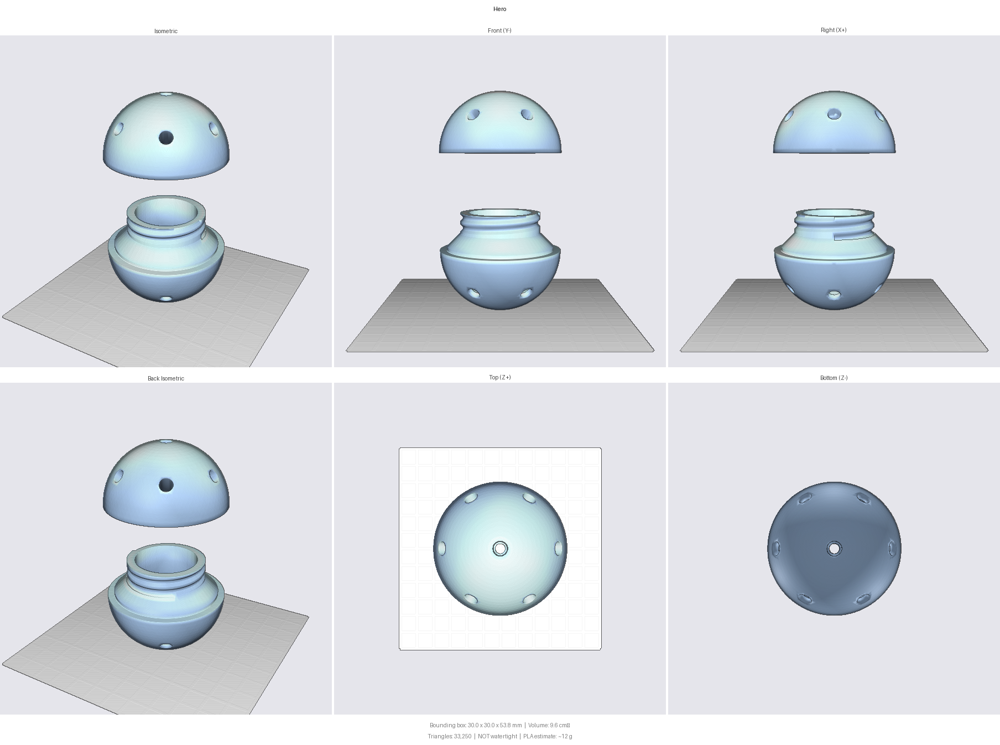

# Catnip Ball

A refillable Ø30 mm catnip ball: a hollow sphere in two halves that **screw
together**, with air holes so the scent gets out. The thread is hidden inside,
so the outside stays a clean, seamless sphere — and both halves print **without
supports**.

Parametric CadQuery model. Edit one number, rebuild, get new STEPs.



## Print it

| | |
|---|---|
| Material | PETG / PCTG (tough, and it gets chewed) — PLA works too |
| Nozzle / layer | 0.4 mm / **0.15–0.2 mm** (finer keeps the thread crisp) |
| Walls | 3 perimeters |
| Infill | 10 % (the shell is nearly solid at 3 walls) |
| Supports | **none** |

**Orientation — both halves dome UP:**

- **Top half** sits on its flat equator rim. Add a brim; the rim is a thin ring.
- **Bottom half** sits on its skirt (the threaded end down on the plate).

That orientation is the whole point of the geometry: every dome only narrows as
it rises, the internal chamfer is 45°, and the single unsupported feature is a
1.7 mm flat ring at the bottom half's equator — short enough to bridge cleanly.

### Assembly

Unscrew, drop a pinch of catnip (or a leaf) through the Ø15.8 mm opening, screw
it back together. Two full turns; the equator rims butt together as a hard stop,
so it always closes flush.

> FDM parts are not food-safe and the halves are small enough to be a choking
> hazard for a determined chewer — supervise your cat, and retire the ball if it
> gets cracked or gnawed open.

## Build from source

Needs Python 3.10–3.12 and CadQuery (`py -3.12 -m pip install cadquery`).

```bash
py -3.12 -m src.build            # writes both STEPs + assembly.step, opens the viewer
py -3.12 -m src.dimensions       # print the resolved dimension table
py -3.12 -m tools.check_overlaps # geometry gate: 0 = no unintended collisions
```

Outputs (gitignored — they're build artifacts):

- `catnip_ball_bottom.step` — male half, threaded skirt
- `catnip_ball_top.step` — female half, threaded socket
- `assembly.step` — both halves, exploded and coloured, for the viewer

## Customising

Everything lives in [`src/dimensions.py`](src/dimensions.py). The useful knobs:

| Constant | What it does |
|---|---|
| `SPHERE_OD` | overall ball diameter |
| `WALL` | shell + socket wall thickness |
| `THREAD_CLR_D` | thread fit — **the one to tune after a test print** |
| `THREAD_TURNS` | how many turns to close it |
| `HOLE_D`, `N_RING` | air-hole size and count |

Dimensions are asserted against each other, so a change that would breach the
shell or starve the thread fails at build time rather than on the printer.

**Thread too tight or too sloppy?** Change `THREAD_CLR_D` and reprint the
*bottom* half only — the clearance is taken entirely off the male thread, so the
top half stays valid. Start at 0.6 mm diametral (0.3/side) for PETG/PCTG; PLA on
a well-tuned printer can go tighter.

## How it works

The tricky part of a screw-together sphere is that the threaded skirt must be
narrower than the sphere so it can hide inside the socket — and that step is a
flat ring the bottom half has to print over. This model keeps that ring down to
`WALL + clearance` (1.7 mm) with a full-width **collar** at the equator, then a
45° chamfer steps in to the thread. Everything below is a plain shell.

Threads come from [`cadkit.threads`](cadkit/THREADS_README.md) — a
self-supporting 45° trapezoidal form. Helical booleans in OpenCASCADE fail
*silently* (a smooth rod, a half-filled part, zero solids), so the thread is cut
last, alone, with `clean=False`, and the parts are never healed. Verified with a
crest solid/void probe rather than by eye.

## Layout

```
src/dimensions.py    all constants + invariants (single source of truth)
src/parts.py         the two revolved profiles + thread cuts
src/build.py         exports STEPs, builds the coloured assembly, opens the viewer
tools/check_overlaps.py   interpenetration gate
cadkit/              shared CAD toolkit, vendored (git subtree)
```

## License

[CERN Open Hardware Licence Version 2 - Strongly Reciprocal](LICENSE)
(`CERN-OHL-S-2.0`) — a licence built for open *hardware* rather than retrofitted
from software or media.

You may use, study, modify, manufacture and **sell** this design and products
made from it. In exchange, if you convey a modified design — or a product made
from one — you must make your modified source available under this same licence
and tell recipients where to find it. In short: **it stays open, including any
version someone sells.**

    Copyright (c) 2026 gustebeast

    This source describes Open Hardware and is licensed under the CERN-OHL-S v2.
    You may redistribute and modify this source and make products using it under
    the terms of the CERN-OHL-S v2 (https://cern.ch/cern-ohl).
    This source is distributed WITHOUT ANY EXPRESS OR IMPLIED WARRANTY,
    INCLUDING OF MERCHANTABILITY, SATISFACTORY QUALITY AND FITNESS FOR A
    PARTICULAR PURPOSE. Please see the CERN-OHL-S v2 for applicable conditions.

    Source location: https://github.com/gustebeast/cat-nip-ball

The vendored `cadkit/` subtree is a separate upstream project and carries its
own terms.
